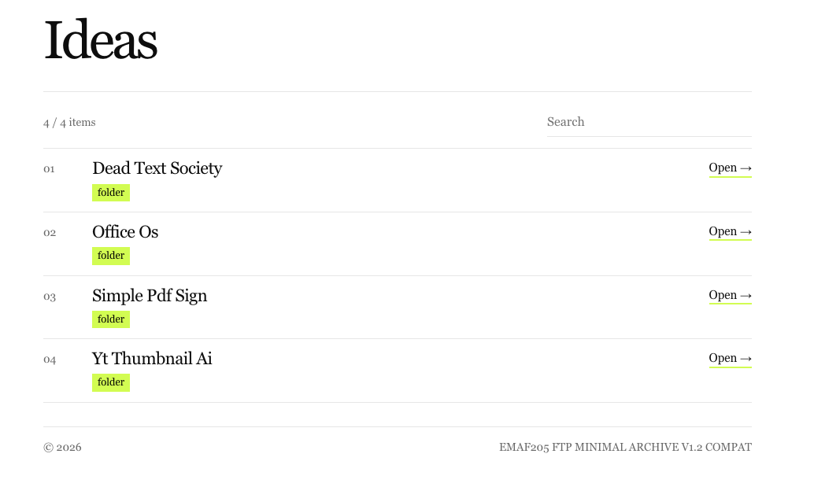
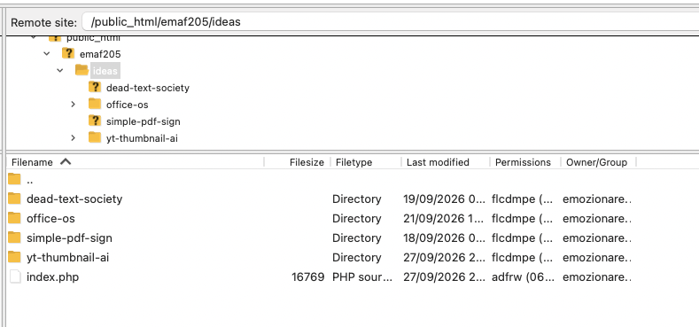

# EMAF205 FTP Minimal Archive

A simple, clean website to show folders, projects, and files as a public archive. No database or CMS needed: upload one PHP file to your hosting and start adding your projects.

## Preview

**Public archive**



**FTP folder structure**



## Features

- Automatically lists folders and files in the same directory.
- Clean, responsive layout for desktop and mobile.
- Search to find items quickly.
- Optional project titles, descriptions, tags, and links.
- Customizable appearance and display settings.
- Works on PHP shared hosting without a database.

## Quick start

1. Upload `index.php` to a folder on your PHP web hosting using FTP.
2. Add your project folders or files next to it.
3. Open that folder's URL in your browser.

The archive updates when you add or remove items.

```text
public_html/
└── ideas/
    ├── index.php
    ├── dead-text-society/
    ├── office-os/
    ├── simple-pdf-sign/
    └── yt-thumbnail-ai/
```

## Optional customization

To change the archive title, description, colors, search, and other settings, copy `page.example.txt` to `page.txt` next to `index.php` and edit it.

To add information about a project, copy `project.example.txt` to `project.txt` inside its folder and edit it.

Both files are optional. The archive works with `index.php` alone.

## Requirements

PHP web hosting and FTP (or another way to upload files). No database or build process required.

## Version

**1.2 Compat** — avoids PHP 8-only features for better compatibility with older shared hosting.

---

Made with ♥ in Milan by **Emanuele BDC**.
